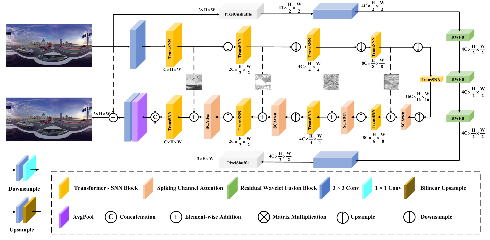
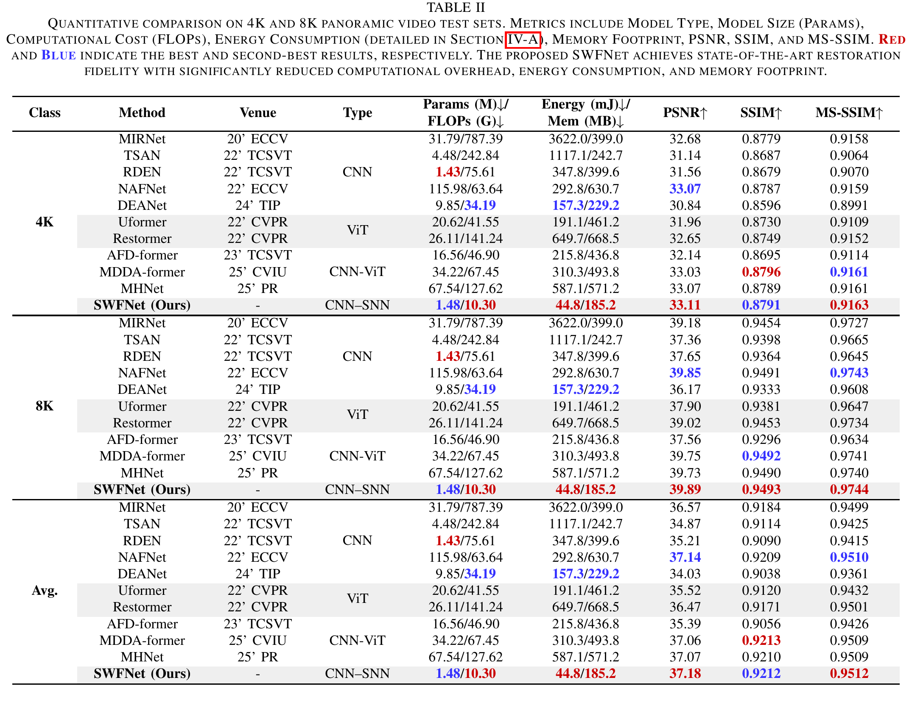
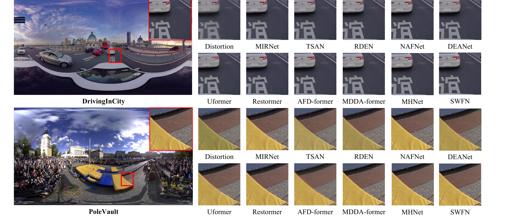
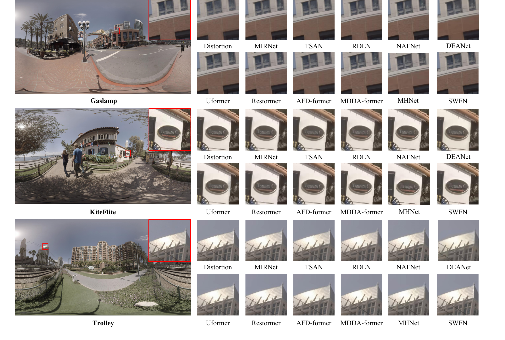
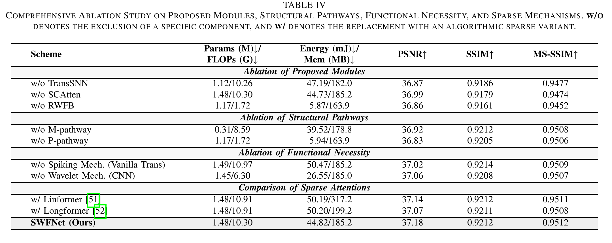

<div align="center">

# SWFNet: A Spiking-Wavelet Fusion Network for Frame-Level Quality Enhancement of VVC-Compressed 360-Degree Video


</div>

## 🔎 Framework

SWFNet is a hybrid CNN-SNN framework for frame-level quality enhancement of VVC-compressed 360-degree video in the Equirectangular Projection (ERP) format. Inspired by the Magnocellular-Parvocellular (M-P) dual-stream mechanism, it combines sparse global structural modeling with multi-scale local texture restoration.



The global M-pathway employs Transformer-SNN (TransSNN) blocks and Spiking Channel Attention (SCAtten) for sparse, content-adaptive structural modeling. The local P-pathway employs Residual Wavelet Fusion Blocks (RWFBs) to restore high-frequency details affected by VVC quantization.

## 📊 Reported Results



SWFNet uses 1.48M parameters and 10.30 GFLOPs. On the reported 4K test set, it achieves the best PSNR and MS-SSIM among the compared methods; on the 8K test set, it achieves the best PSNR, SSIM, and MS-SSIM.

<details>
<summary><b>🖼️ Visual Results and Ablation Studies</b></summary>

<br>









</details>


## 🎓 Citation

If you find this work useful, please cite:

```bibtex
@article{cao2026swfnet,
  title={SWFNet: A Spiking-Wavelet Fusion Network for Frame-Level Quality Enhancement of VVC-Compressed 360-Degree Video},
  author={Cao, Ziyi and Yin, Haibing and Wang, Hongkui and Li, Tiansong and Huang, Xiaofeng and Zhang, Jiyong},
  journal={IEEE Transactions on Circuits and Systems for Video Technology},
  year={2026}
}
```
## ❤️ Acknowledgement

We thank the authors of [AFD-former](https://github.com/House-yuyu/AFD-former) for their valuable work and open-source contribution.
