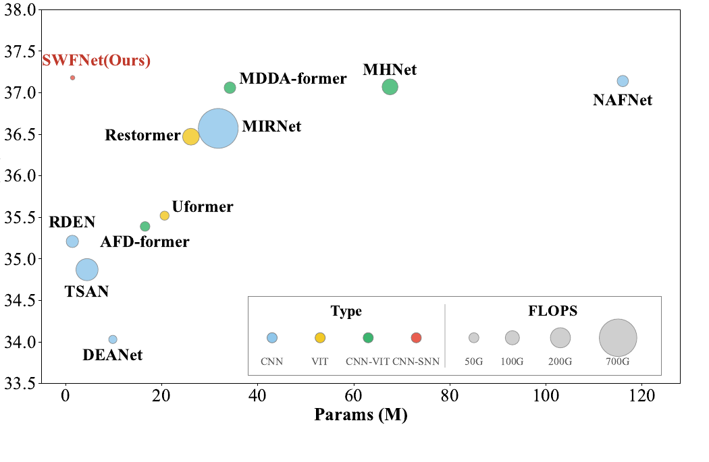
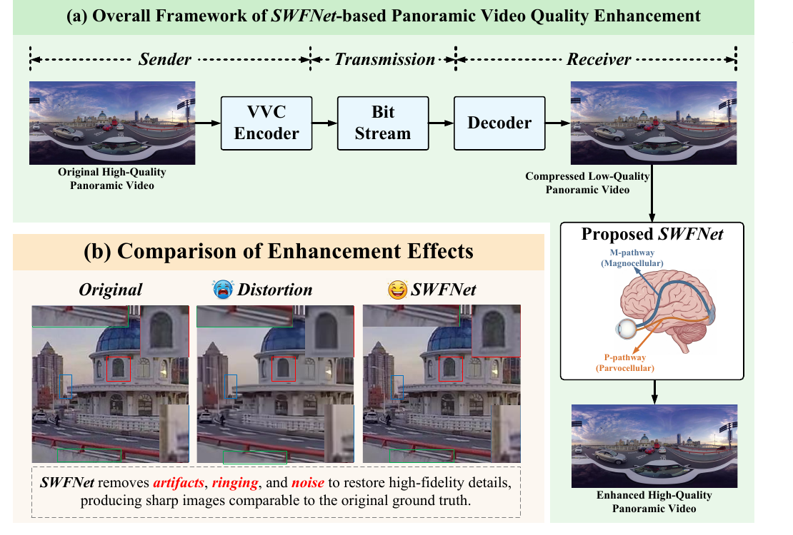
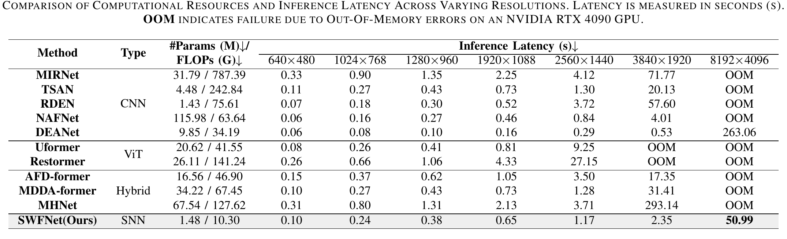
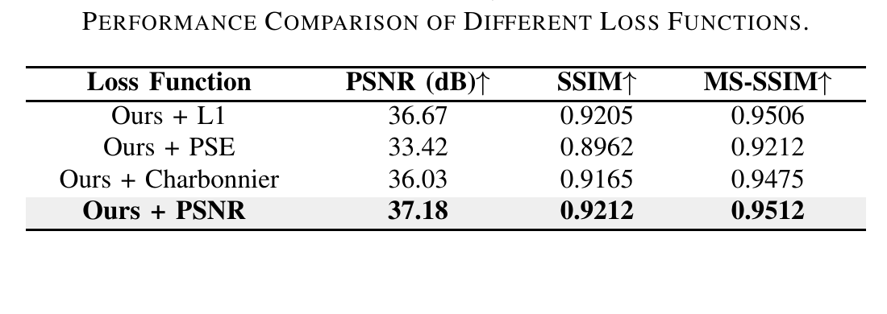

# SWFNet Visual Assets

This document is ready to render with the accompanying `images/` directory. Keep the relative image paths unchanged when adding these sections to the repository.

## Motivation: Performance and Complexity

**Figure 1. Performance-complexity trade-off.** The horizontal axis is the number of parameters, the vertical axis is PSNR, and bubble size represents FLOPs. In the reported comparison, SWFNet uses 1.48M parameters and 10.30 GFLOPs.

## Framework Overview and Biological Motivation

**Figure 2. SWFNet-based panoramic video quality enhancement.** VVC compression creates a low-quality ERP frame that is enhanced by SWFNet. The design is functionally inspired by the Magnocellular-Parvocellular (M-P) dual-stream mechanism: the M-pathway models global structure and the P-pathway restores local details. The visual comparison highlights artifact, ringing, and noise reduction.

## SWFNet Architecture

**Figure 3. Overall architecture of SWFNet.** The encoder uses Transformer-SNN (TransSNN) blocks for sparse global structural modeling. The decoder uses Spiking Channel Attention (SCAtten) to modulate channels and suppress compression noise. Residual Wavelet Fusion Blocks (RWFBs) provide multi-scale local texture restoration.

## Quantitative Results

**Table II. Quantitative comparison on 4K and 8K panoramic video test sets.** The table reports parameters, FLOPs, estimated energy, peak memory, PSNR, SSIM, and MS-SSIM. On the reported 4K set, SWFNet achieves 33.11 dB PSNR, 0.8791 SSIM, and 0.9163 MS-SSIM; on the 8K set, it achieves 39.89 dB, 0.9493, and 0.9744, respectively. The energy values are theoretical estimates based on MAC and sparse AC operation costs, not hardware power measurements.

## Qualitative Comparison at 4K

**Figure 10. Qualitative comparison on 4K test videos.** The figure compares enhancement results for the DrivingInCity and PoleVault sequences. Red boxes denote the enlarged regions.

## Qualitative Comparison at 8K

**Figure 11. Qualitative comparison on 8K test videos.** The figure compares Gaslamp, KiteFlite, and Trolley sequences at ultra-high resolution. Red boxes denote the enlarged regions.

## Resolution Scalability and Latency

**Table III. Computational resources and inference latency.** Latency is measured in seconds on an NVIDIA RTX 4090 GPU; `OOM` denotes an out-of-memory failure. At 8192 x 4096, SWFNet completes one frame in 50.99 s. DEANet completes the same test in 263.06 s, while the other listed methods are marked OOM.

## Module and Pathway Ablation

**Table IV. Ablation study of modules, pathways, functional mechanisms, and sparse-attention variants.** The complete SWFNet obtains 37.18 dB PSNR, 0.9212 SSIM, and 0.9512 MS-SSIM in the reported average comparison. Removing TransSNN, SCAtten, RWFB, or either dual-stream pathway reduces restoration fidelity.

## Loss-Function Ablation

**Table V. Loss-function comparison.** The PSNR-oriented loss gives the highest reported PSNR (37.18 dB) and MS-SSIM (0.9512) among the listed loss configurations.
